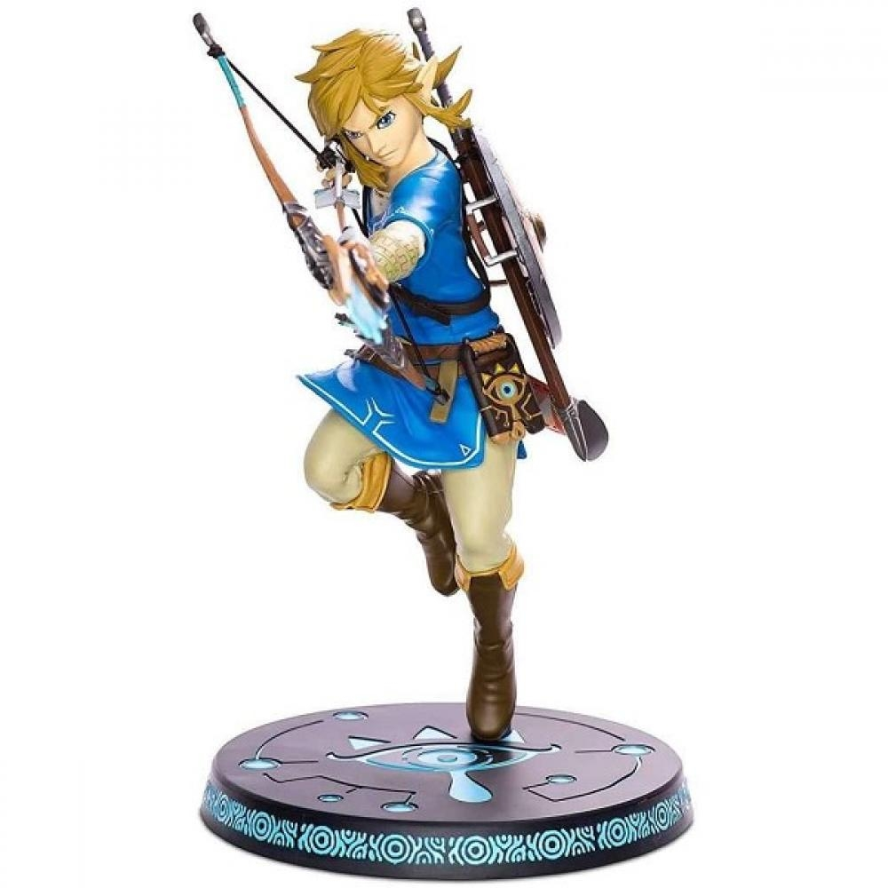
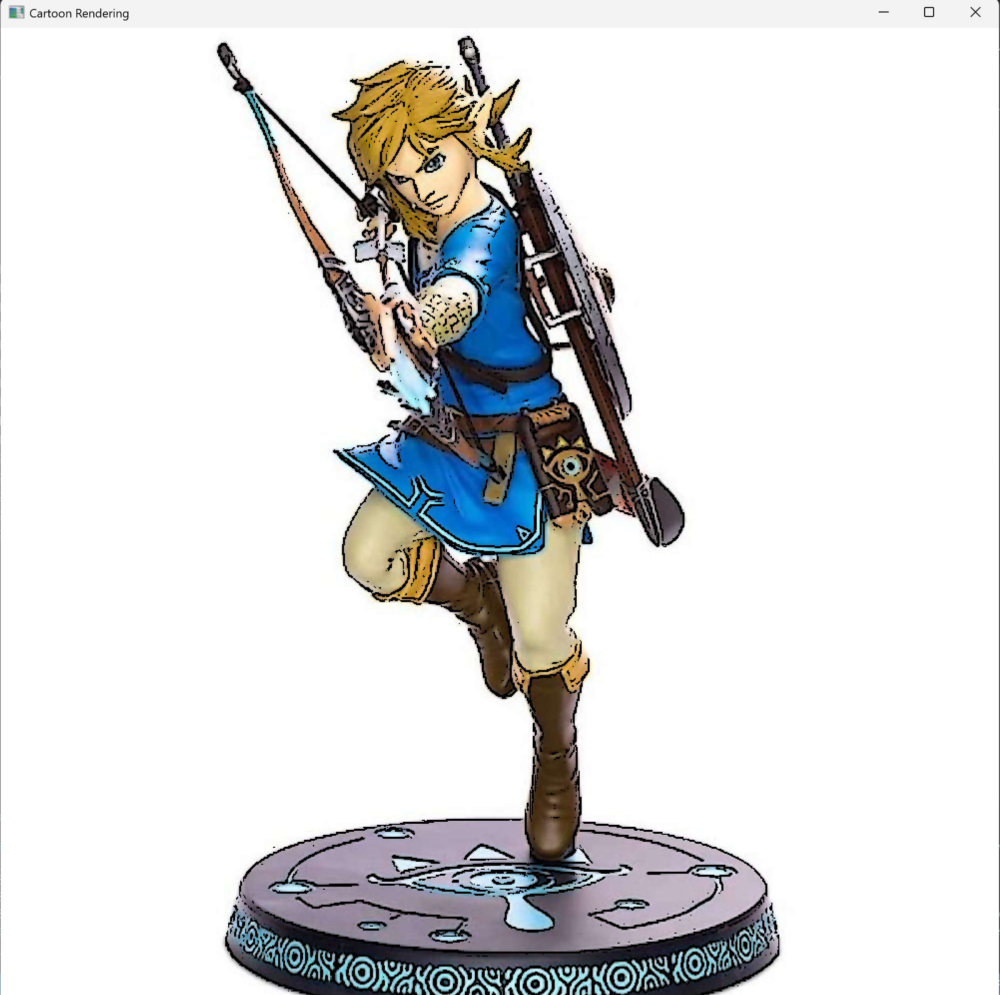
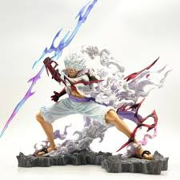
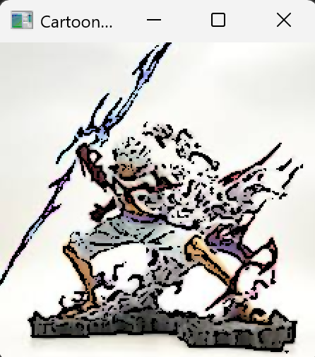

# image_cartoon_converter

A Python tool using OpenCV to transform standard images into cartoon-style renderings by combining bilateral filtering and adaptive thresholding.

## Example Results

### 1. Effective Demo (Success Case)
This case shows a successful transformation with clear boundaries and vibrant colors.

* **Input Image**: `image_0.jpg`
* **Why it works**: The subject has high contrast with the background, and the pixel density is optimal for the fixed parameters in the script, allowing for clean and sharp outlines.

### 2. Ineffective Demo (Failure Case)
This case demonstrates where the algorithm struggles to produce a clean cartoon effect.

* **Input Image**: `image_1.jpg`
* **Why it fails**: 
    1. **Color & Contrast**: The figure is primarily white, making it difficult for the adaptive thresholding to distinguish between the subject's edges and the bright highlights, resulting in broken or missing outlines.
    2. **Pixel Dimensions**: There is a significant difference in the total pixel count compared to the successful case. Since the `blockSize` for edge detection is fixed in the code, the larger/smaller resolution makes the lines appear either too noisy or too faint.

## Features

- **Cartoon Effect**: Converts photos into stylized cartoon art.
- **Edge Detection**: Generates bold outlines using adaptive thresholding.
- **Bilateral Filter**: Smoothes colors while preserving sharp edges.
- **Comparison View**: Displays original and processed images side-by-side.

## Project Files

- `Image_Cartoon_Converter.py`: Main execution script.
- `image_0.jpg` / `image_1.jpg`: Input image files.
- `screenshot_0.png` / `screenshot_1.png`: Result screenshots for demonstration.
- `cartoon_output.jpg`: The final processed output.

## Requirements

- Python 3.x
- OpenCV (`cv2`)
- NumPy
